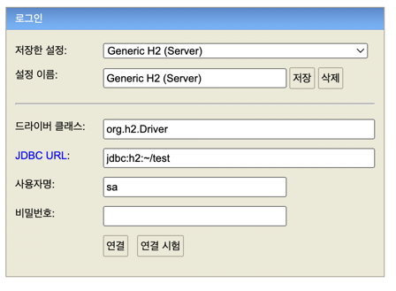

<h2>Start H2 Database</h2>
1. unzip h2-2022-06-13.zip
2. run h2.sh
3. At first time, JDBC URL should be `jdbc:h2:~/test`

<h2>Create Table</h2>
create table student (
id bigint not null,
name varchar(20) not null,
schoolId bigint not null,
schoolName varchar(20) not null,
primary key (id)
);

create table school (
id bigint not null,
name varchar(20) not null,
primary key (id)
)

insert into student values (1L, '철수', 1L, '서울고');
insert into school values (1L, '서울고');